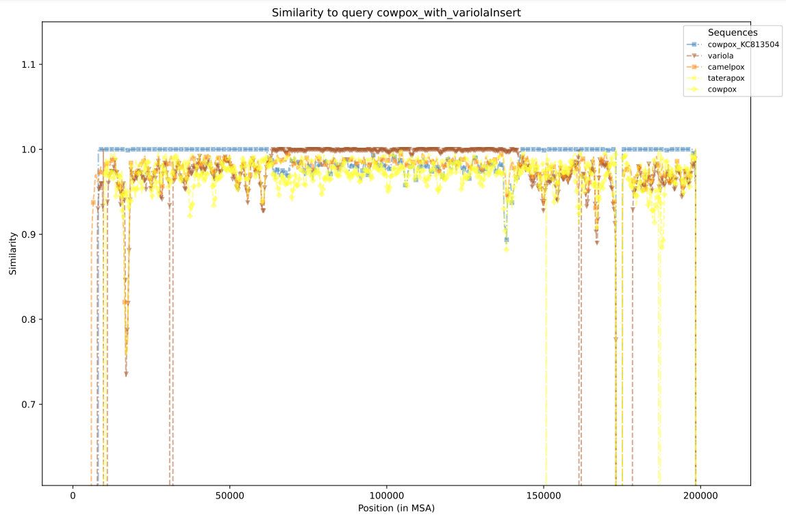
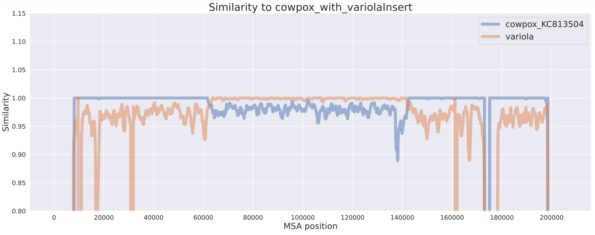

# RecomFi
RecomFi (Recombination Finder) identifies recombination events in a query sequence, contigs or genome, against a collection of reference sequences.

# Description
RecomFi is developed to identify recombination in relatively similar datasets, such as between (sub)species of a genus or family. It generates a reference-anchored "pseudo-MSA (multiple sequence alignment)" by using one sequence as a backbone. This makes RecomFi fast but limits the resolution. With the pseudo-MSA strategy the query may be a fragmented genome, for example a set of contigs, which RecomFi organizes relative to the backbone.

Recombination events are detected by sliding a window over the MSA and computing, in each window, the similarity between the query and each reference. A recombination event is indicated where the query is near reference A across most of its length but is near another reference B over a region.

RecomFi is organized as a small, modular Python package:
- Alignment is delegated to a pluggable **aligner backend** (`progressivemauve`, `sibeliaz`, or `cactus`), discovered through entry points so additional backends can be added without changing the core.
- The recombination scan uses a built-in sliding-window distance engine (no external alignment-analysis dependency).

# Installation
RecomFi needs Python (>= 3.11) and at least one aligner backend. The aligner binaries are most easily installed with conda.

```
# create an environment with an aligner backend, then install RecomFi
conda create -n recomfi -c conda-forge -c bioconda python">=3.11" mauve "boost-cpp=1.74.0"
conda activate recomfi
pip install .
```

Optional aligner backends can be added to the same environment:
```
conda install -c bioconda sibeliaz   # or: cactus
```

An `environment.yml` is provided that installs Python, all three backends, and RecomFi in one step:
```
conda env create -f environment.yml
conda activate recomfi
```

# Aligner backends
All backends produce a reference-anchored alignment, which is what the recombination scan assumes. Choose with `--aligner` and tune with repeatable `--aligner-arg key=value`:

| Backend | Best for | Notes |
|---|---|---|
| `sibeliaz` (default) | Moderately divergent genomes, including rearrangements | Installs cleanly via conda; `kmer`, `abundance`, `bubble`, `filtermemory` |
| `mafft` | Similar, largely collinear genomes | True base-level alignment, the canonical input for the window method; adds a fragmented query with `--addfragments`. `maxiterate`, `retree`, `op`, `ep`, `sixmerpair` |
| `minimap2` | Speed and assembly/contig queries | Fast assembly-to-reference projection; `preset` (default `asm20`, e.g. `asm10` for closer genomes) |
| `progressivemauve` | Genomes with large rearrangements/inversions | Tolerant but slow, heavy, and not available as a conda build on all platforms; `seed_weight`, `single` |
| `cactus` | Same-species pangenomes | Resource heavy (Toil/containers) |

`sibeliaz` is the default: it installs cleanly across platforms and, on the example data, reproduces `progressivemauve`'s recombination coordinates. For very similar, collinear genomes `mafft` gives the most faithful base-level signal and `minimap2` the fastest run (and the best fit for a fragmented query); `progressivemauve` remains an option for genomes with large rearrangements. Reference-anchored backends drop material inserted relative to the backbone; `mafft` keeps it as a true alignment.

Example: `recomfi msa ... --aligner minimap2 --aligner-arg preset=asm10` or `recomfi msa ... --aligner mafft --aligner-arg maxiterate=1000`.

# Example dataset
Find an example dataset of orthopoxvirus in `example_data/`. The query is a short-read assembly (8 contigs) of a synthetic cowpox sample with a variola segment. The collection are reference-labelled orthopoxvirus sequences from `BV-BRC.org`.

Example folder structure (query is `cowpox_with_variolaInsert.fasta.gz`):
```
.
├── collection
│   ├── camelpox.fasta.gz
│   ├── cowpox.fasta.gz
│   ├── cowpox_KC813504.fasta.gz
│   ├── monkeypox.fasta.gz
│   ├── taterapox.fasta.gz
│   ├── vaccinia.fasta.gz
│   └── variola.fasta.gz
└── cowpox_with_variolaInsert.fasta.gz
```

# Usage
Generate a multiple sequence alignment:
```
recomfi msa --query cowpox_with_variolaInsert.fasta.gz --collection collection/ --output msa.fasta

# Choose an aligner backend (default: sibeliaz) and pass tuning options:
#   recomfi msa ... --aligner sibeliaz --aligner-arg kmer=15
#   recomfi msa ... --aligner progressivemauve --aligner-arg seed_weight=11
#
# If you have a single-contig query you can use it as the backbone instead of a
# reference from the collection:
#   recomfi msa ... --query-as-backbone
```

Identify recombination events (state the query label as it appears in the MSA, i.e. the query file name without extension):
```
recomfi recomb --msa msa.fasta --query cowpox_with_variolaInsert --output recomfi_out

# The window, step, metric, number of plotted datasets and plot format are
# configurable:
#   recomfi recomb ... --window-size 1000 --window-step 100 --top-n 5 --plot-format png
#
# Region calling can be tuned (defaults derive from the window size):
#   recomfi recomb ... --min-region 1000 --margin 0.0 --merge-gap 1000
```

Run `recomfi --help`, `recomfi msa --help` or `recomfi recomb --help` for the full set of options.

# Output
RecomFi computes, in sliding windows across the MSA, the similarity of the query to each reference (1 = identical, 0 = no similarity). For each window the closest reference (or references, on a tie) is the "winner". The reference winning the most windows is the **major parent** (the backbone donor); a stretch where the query is instead closest to another reference (a **minor parent**) is reported as a recombinant region.

The terminal output (also written to the run log) summarises the window winners, the per-dataset similarity statistics, and the called regions, for example:
```
Recombination regions (major parent: cowpox_KC813504):
  Minor parent  Major parent     MSA start  MSA end  Query start  Query end  Length(bp)  Windows  Sim minor  Sim major
  ---------------------------------------------------------------------------------------------------------------------
  variola       cowpox_KC813504  60500      141000   58800        138900     80500       790      0.992      0.951
```

The **region calling is a transparent heuristic screen, not a statistical significance test** (such as 3SEQ or RDP). Treat the regions as candidates to inspect, not confirmed events.

Output files in the chosen directory:

| File | Contents |
|---|---|
| `recombination_regions.tsv` | Called regions: minor/major parent, start/end in **both MSA columns and query bases**, length, support, mean similarities |
| `similarity_windows.tsv` | Full per-window matrix: `msa_position`, `query_position`, `winner`, and one similarity column per dataset |
| `similarity_stats.tsv` | Per-dataset similarity statistics (median, windows above identity thresholds) |
| `window_winners.tsv` | Per-dataset count of windows won (ties included) |
| `coverage_gaps.tsv` | Stretches where even the closest reference is a poor match — possible missing references |
| `similarity_top{N}.{fmt}` | Static plot of the nearest `--top-n` datasets, called regions shaded |
| `similarity_pair.{fmt}` | Static plot of the major vs leading minor parent, region shaded |
| `report.html` | Self-contained report: run provenance, the region table, the per-dataset stats, and an embedded interactive plot |

Similarity is computed only over columns where both sequences carry a canonical base (A/C/G/T); gaps, `N` and IUPAC ambiguity codes are ignored, so an `N` never counts as a match. A window with no comparable position — for example an inter-contig gap in a fragmented query — is uninformative and reported as `NA` in `similarity_windows.tsv` (and excluded from the winners, statistics and region calling).

Query coordinates are reported alongside MSA coordinates, so regions no longer need to be mapped back to the query by hand.

A plot is generated for the nearest datasets (`--top-n`, default 5), showing similarity across the MSA with called regions shaded.
 \
**Similarity in each window of the nearest five sequences to the query. Values towards 1 indicate high similarity. Here the query is most similar to a Cowpox sequence but has a region in the middle similar to a Variola sequence — a putative recombination event, called automatically and reported in `recombination_regions.tsv` in both MSA and query coordinates.**

The pairwise plot shows the major parent against the leading minor parent:
 \
**The two sequences most likely involved in the recombination, with the called region shaded.**

# Is a reference missing?
RecomFi always reports the *closest* reference, even when every reference is far
from the query — so a recombinant whose true donor is not in the collection is
still assigned to the least-bad reference. To catch this, the scan also reports
**reference coverage**: stretches where even the closest reference is below a
best-similarity threshold (adaptive by default, or set with `--coverage-floor`).
These are written to `coverage_gaps.tsv`, shaded on the report, and flagged with a
caveat banner; a region labelled `divergent` (ample comparable bases, yet a poor
match) is the signature of an absent reference, as opposed to `low_information`
(too few comparable bases to judge).

When a gap is found, `recomfi find-references` searches NCBI for the missing
genome: it BLASTs the under-covered query subsequence against `nt`, reports
candidate references (accession, identity, whether already in your collection),
and — with `--download` — fetches the best new one into a collection directory to
re-run with.
```
recomfi find-references --msa msa.fasta --query cowpox_with_variolaInsert \
    --collection collection/ --email you@example.org --download collection/
```
This contacts NCBI over the network; `--download` needs Entrez Direct
(`conda install -c bioconda entrez-direct`). BLAST often returns the query's own
GenBank record (the MSA labels the query by name, not accession), so a
near-identical, near-full-length hit is auto-skipped; use `--keep-self-hits` to
keep it, or `--exclude <accession>` to drop specific records.

To do this repeatedly until coverage stops improving, `recomfi fill-references`
runs the whole cycle — build MSA, scan, BLAST, download — for several rounds,
growing a copy of the collection each time:
```
recomfi fill-references --query cowpox_with_variolaInsert.fasta.gz \
    --collection collection/ --output filled/ --aligner mafft --email you@example.org
```
It stops when the gaps close, when no new reference can be found, or when a round
no longer improves the worst gap (so a genuinely hypervariable region is reported,
not chased forever). Each round is recorded in `filled/fill_summary.tsv`, and the
query's own record is auto-excluded from its FASTA header. This needs an aligner
and Entrez Direct, and rebuilds the alignment every round.

# Known limitations
The region calling is a transparent heuristic, not a statistical test. In
particular: overlapping windows (step < window) make the per-window series
autocorrelated, so the window counts are not independent observations; the
default `--margin 0.0` calls a region on any positive similarity difference (raise
it to require a meaningful margin); and there is no significance test, null model
or multiple-testing correction. Treat regions as candidates for follow-up with a
dedicated method (3SEQ, RDP).

# Development
```
pip install -e ".[dev]"
ruff check src tests
pytest                       # add -m "not requires_binary" to skip aligner-dependent tests
```
