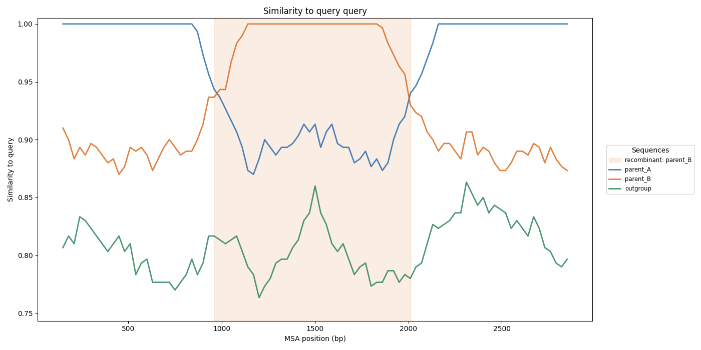

# Tessera

Tessera identifies recombination events in a query sequence, set of contigs, or
genome against a collection of reference sequences -- the parental-segment boundaries
of the mosaic a recombinant genome is.

## Overview

Tessera is built to detect recombination in relatively similar datasets, such as
between the (sub)species of a genus or family. It builds a reference-anchored
"pseudo-MSA" using one sequence as a backbone -- fast, and able to organize a
fragmented query (a set of contigs) relative to the backbone, at the cost of some
resolution. It then scans the alignment in sliding windows, comparing the query to
each reference: a recombination event shows up where the query is close to reference
A across most of its length but close to reference B over a region.

Detection combines three complementary methods: an **HMM segmentation** caller, a
scan-aware **3SEQ** triplet test, and a **parent-free** PHI/Rmin diagnostic that fires
even when the true donor is absent from the panel. Tessera also recruits and curates
the reference panel for you, types references by lineage, and writes a self-contained
HTML report. It is a small, dependency-free Python package; alignment is delegated to
a pluggable [aligner backend](docs/aligners.md).

## Installation

Tessera needs Python (>= 3.11) and at least one aligner backend, most easily installed
with conda:

```
conda create -n tessera -c conda-forge -c bioconda python">=3.11" mauve "boost-cpp=1.74.0"
conda activate tessera
pip install .
```

Or install Python, all backends, and Tessera in one step from the provided
environment file:

```
conda env create -f environment.yml
conda activate tessera
```

See [docs/aligners.md](docs/aligners.md) for the backend options and when to use each.

## Quickstart

**One-shot detection.** Give Tessera only a query and it detects the taxon, recruits a
diverse reference panel from NCBI, aligns, and calls recombination:

```
tessera detect --query CRF01_AE.fasta --output out/ --email you@example.org
```

The report (`out/report.html`) carries a plain-language verdict with a confidence
label. Fetched panels are cached per taxon, so a repeat run is fast. `detect` needs an
aligner and Entrez Direct; skani/skDER and the `datasets` CLI improve recruitment. For
a heavily sequenced taxon (e.g. SARS-CoV-2) supply a local panel with
`--candidate-pool`. How the panel is recruited, found, and curated is covered in
[docs/reference-panels.md](docs/reference-panels.md).

**Manual two-step.** When you already have an alignment, scan it directly. The shipped
example needs no aligner:

```
tessera recomb --msa example_data/divergent.msa.fasta --query query --output out/ \
    --window-size 300 --window-step 30
```

State the query label to `recomb` as it appears in the MSA (for a FASTA you align
yourself, the query file name without extension). To build the alignment from
unaligned genomes first, run `tessera msa --query q.fasta --collection refs/ --output
msa.fasta` (see [docs/aligners.md](docs/aligners.md); `--query-as-backbone` uses a
single-contig query as the backbone). The window, step, caller, and region-calling
parameters are configurable -- see [docs/detection-methods.md](docs/detection-methods.md)
and `tessera recomb --help`.

Run `tessera --help` (or `tessera <command> --help`) for the full set of commands and
options: `detect`, `build-panel`, `msa`, `recomb`, `find-references`,
`fill-references`, `curate-panel`.

## Example dataset

`example_data/` holds two small, pre-aligned synthetic alignments that run directly
with `tessera recomb` (no aligner needed) and contrast the detection methods:

- `divergent.msa.fasta` -- parents ~11 % apart, a large insert. The default HMM caller
  localizes the mosaic confidently (q ~1e-29); the figure below shows the crossover.
- `cryptic_insert.msa.fasta` -- parents ~1 % apart, a short 800 bp insert. The HMM
  finds nothing, but `--method 3seq` recovers it (q ~1e-12) -- the case the triplet
  test exists for.

Each is a `query` (a `parent_A` backbone with a `parent_B` insert), the two parents,
and an outgroup. See [example_data/README.md](example_data/README.md) for the exact
commands; regenerate with `python example_data/make_example.py`.

## How detection works

The reference winning the most windows is the **major parent** (the backbone donor).
The default HMM caller then reports a segment as recombinant only when a donor beats
the major parent on the **discordant sites** by a sign test, so it recovers subtle
breakpoints without inventing regions from noise. On near-identical panels (mpox, VZV,
within-species sets) Tessera automatically switches to **informative-site windowing**
to keep the signal from being diluted. Every run also reports the parent-free PHI test
and Hudson-Kaplan Rmin, which flag recombination even when the donor is missing from
the panel.

Each called region carries a support, a sign-test p-value with a Benjamini-Hochberg
q-value, and a breakpoint interval. Full detail -- the HMM, low-divergence windowing,
the 3SEQ test, and the PHI/Rmin diagnostic -- is in
[docs/detection-methods.md](docs/detection-methods.md).



*`example_data/divergent.msa.fasta`. The query tracks `parent_A` (similarity ~1)
except over the shaded called region, where it switches to `parent_B` -- a
recombination event, called automatically and reported in both MSA and query
coordinates.*

## Output

The main output is a self-contained `report.html` with the verdict, region table,
per-dataset statistics, and an embedded interactive plot. Alongside it Tessera writes
TSVs for the called regions (`recombination_regions.tsv`), the parent-free signal
profile (`recombination_profile.tsv`), the full per-window similarity matrix, and the
reference-coverage gaps. The full file list and the meaning of each column are in
[docs/detection-methods.md](docs/detection-methods.md#output-files).

## Documentation

- [Aligner backends](docs/aligners.md) -- choosing and tuning the alignment backend.
- [Detection methods and output](docs/detection-methods.md) -- the HMM, 3SEQ, and
  PHI/Rmin callers, low-divergence windowing, and every output file.
- [Building and curating the reference panel](docs/reference-panels.md) -- recruiting
  donors, finding and filling missing references, seed modes and sources, and panel
  curation.

## Known limitations

Tessera is an indicative screen, not a full phylogenetic recombination test. It
compares the query to a fixed reference panel rather than inferring trees (so it
cannot resolve which lineage is ancestral), uses a single substitution model, and
applies no genome-wide multiple-testing correction across regions. Confirm strong
candidates with a dedicated method (3SEQ, GARD, RDP). When a region's donor is itself a
poor match, the result flags a possible missing reference rather than a confident
event.

## Development

```
pip install -e ".[dev]"
ruff check src tests
pytest                       # add -m "not requires_binary" to skip aligner-dependent tests
```
