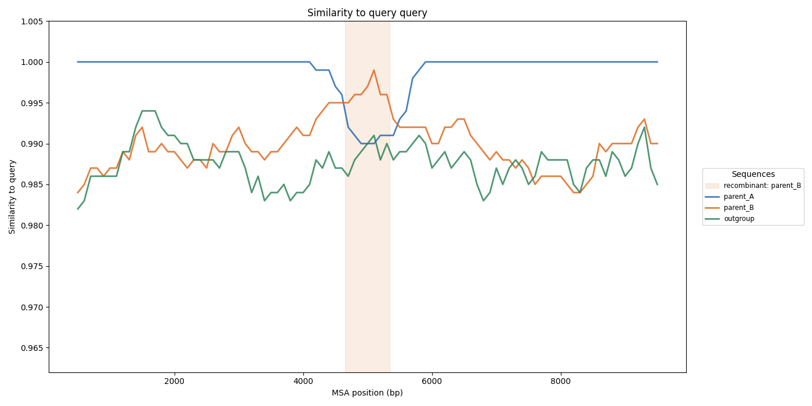

# Detection methods and output

Tessera computes, in sliding windows across the MSA, the similarity of the query to
each reference (1 = identical, 0 = no similarity). The reference winning the most
windows is the **major parent** (the backbone donor). On top of that windowed
similarity it runs one of two parent-attributed callers, plus a parent-free
diagnostic that runs for every method.

## HMM caller (`--method hmm`, default)

The default caller segments the query against the reference panel with a hidden
Markov model (jpHMM-style): each window emits a binomial copying likelihood per
reference, and a single jump rate (`--jump-rate`) penalises switching reference, so
near-identical references do not flip and thin windows cannot drive a call. A segment
is reported as recombinant only when its donor beats the major parent on the
**discordant sites** -- positions where the query matches one candidate parent but
not the other -- by a sign test at level `--alpha`. This is far more discriminating
than an all-sites margin (it recovers subtle breakpoints between near-identical
parents) and does not invent regions from noise.

Each region carries a **support** (the share of distinguishing sites favouring the
donor), a sign-test **p-value** with a Benjamini-Hochberg **q-value**
(false-discovery-rate across the segments tested), and a **breakpoint uncertainty
interval**. A high support with a small q-value is a confident call; a region with
strong directional support but a large q-value (few distinguishing sites, e.g. a
recombination between near-identical lineages) is flagged as marginal rather than
dropped. The legacy `--method heuristic` (margin / merge-gap / min-region) is kept
for comparison.

```
Recombination regions (major parent: cowpox_KC813504):
  Minor parent  Major parent     Query start  Query end  Length(bp)  Sim minor  Sim major  Support  q-value  Breakpoint
  --------------------------------------------------------------------------------------------------------------------
  variola       cowpox_KC813504  66268        147150     80882       0.999      0.977      0.97     2e-300   66768
```

### Low-divergence panels (intra-species sets, DNA viruses)

When the references are nearly identical -- e.g. mpox clades (~0.5 %), VZV (~0.2 %),
within-species ebola -- a fixed base-pair window holds only a handful of
discriminating columns diluted by hundreds of identical ones, so the per-reference
emission contrast collapses and the segmentation loses power. The signal is still
there (low *percentage* divergence over a large genome is still hundreds of variable
sites), just buried. Tessera therefore switches to **informative-site windowing**:
windows span a fixed number of polymorphic columns rather than a fixed base-pair
width, concentrating the signal so the HMM regains contrast. This is automatic when
the references differ at less than ~8 % of columns, and controllable with
`--informative-sites` / `--no-informative-sites` (and `--informative-window` /
`--informative-step`). Breakpoint intervals are necessarily coarser at low divergence
-- you cannot localise a switch more finely than the spacing of the discriminating
sites.

## 3SEQ caller (`--method 3seq`, scan-aware triplet test)

A second caller, complementary to the HMM, after Boni, Posada & Feldman (2007). For
the query against the major parent and each candidate donor it looks only at the
**discriminating sites** (where the two parents differ and the query matches one of
them) and measures the **maximum drawdown** of the resulting +1/-1 walk -- a
sustained run of donor matches inside the backbone, i.e. a mosaic. Its p-value is the
*exact* probability that a random arrangement of the same matches reaches that
drawdown (a dynamic program over the walk depth, no dependency; a vectorised
permutation falls back for very large inputs), Benjamini-Hochberg-corrected across
the donors tested. Because it is purely informative-site based it keeps full power on
near-identical panels -- it detects the mpox clade-I/II recombination where base-pair
windowing finds nothing -- and because the null accounts for scanning every
breakpoint it does not over-call.

## Parent-free recombination signal (PHI + Rmin)

Alongside the parent-attributed regions, every run reports a parent-agnostic
diagnostic that asks only whether the alignment carries recombination at all, with no
candidate parents required -- the regime where the HMM and 3SEQ callers have least to
work with (low divergence, or the true donor absent from the panel). It is built from
the alignment's biallelic informative columns and the four-gamete test (two columns
are incompatible when all four gametes are present, which implies a recombination
between them).

The **PHI test** (Pairwise Homoplasy Index; Bruen, Philippe & Bryant 2006) is
significant when columns near each other on the genome are more compatible than a
random reordering -- the signature of shared local genealogy under recombination --
with a one-sided permutation p-value. **Rmin** (Hudson & Kaplan 1985) is the minimum
number of recombination events the incompatibilities force, with the intervals as
breakpoint candidates. Both are dependency-free.

On the synthetic-hybrid harness, Rmin is non-zero for every recombinant across the
full divergence range (dengue serotypes at 33 % down to the mpox clade-I/II
recombination at 0.5 %), and the PHI test reaches the permutation floor in most
cases. PHI's genome-wide p-value is conservative in Tessera's typical setup, though:
when the panel is clean parental clades around a single hybrid query, the many
clade-defining sites are mutually compatible and dilute the few incompatibilities the
one query introduces, so PHI can stay non-significant even where detection succeeds
(e.g. yellow fever). In that regime Rmin and the per-site PHI **profile** -- which
localizes the signal rather than averaging it away -- are the more informative
parent-free outputs. The diagnostic runs for every `--method`; disable with
`--no-phi`, or widen its window with `--phi-window`.

This all remains an **indicative screen**: the built-in HMM and 3SEQ tests are fast
triplet/segmentation screens, not a full tree-based analysis (such as GARD). Treat
regions as candidates to confirm.

## Output files

| File | Contents |
|---|---|
| `report.html` | Self-contained report: run provenance, the region table, the per-dataset stats, and an embedded interactive plot |
| `recombination_regions.tsv` | Called regions: minor/major parent, start/end in **both MSA columns and query bases**, length, support, mean similarities |
| `recombination_profile.tsv` | Parent-free signal: header with the PHI p-value and Rmin, then per-informative-site local incompatibility (the PHI profile) |
| `similarity_windows.tsv` | Full per-window matrix: `msa_position`, `query_position`, `winner`, and one similarity column per dataset |
| `similarity_stats.tsv` | Per-dataset similarity statistics (median, windows above identity thresholds) |
| `window_winners.tsv` | Per-dataset count of windows won (ties included) |
| `coverage_gaps.tsv` | Stretches where even the closest reference is a poor match -- possible missing references |
| `similarity_top{N}.{fmt}` | Static plot of the nearest `--top-n` datasets, called regions shaded |
| `similarity_pair.{fmt}` | Static plot of the major vs leading minor parent, region shaded |

Similarity is computed only over columns where both sequences carry a canonical base
(A/C/G/T); gaps, `N` and IUPAC ambiguity codes are ignored, so an `N` never counts as
a match. A window with no comparable position -- for example an inter-contig gap in a
fragmented query -- is uninformative and reported as `NA` in `similarity_windows.tsv`
(and excluded from the winners, statistics and region calling). Query coordinates are
reported alongside MSA coordinates, so regions need not be mapped back to the query by
hand.


*`example_data/divergent.msa.fasta` (parents ~11 % apart). The query tracks `parent_A`
except over the shaded called region, where it switches to `parent_B`. With divergent
parents the HMM caller localizes the event confidently (q ~1e-29); 3SEQ agrees.*



*`example_data/cryptic_insert.msa.fasta` (parents ~1 % apart, an 800 bp insert with
~10 discriminating sites). The dip is shallow and narrow, so the HMM segmentation
finds nothing across a base-pair window; `--method 3seq` pools the discriminating
sites and recovers the shaded region (q ~1e-12).*
